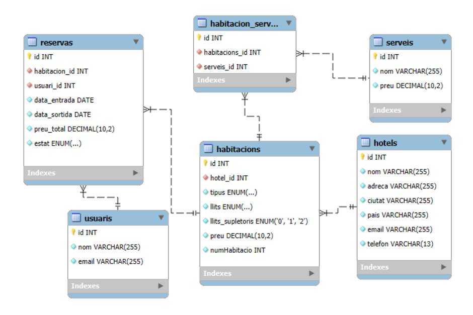
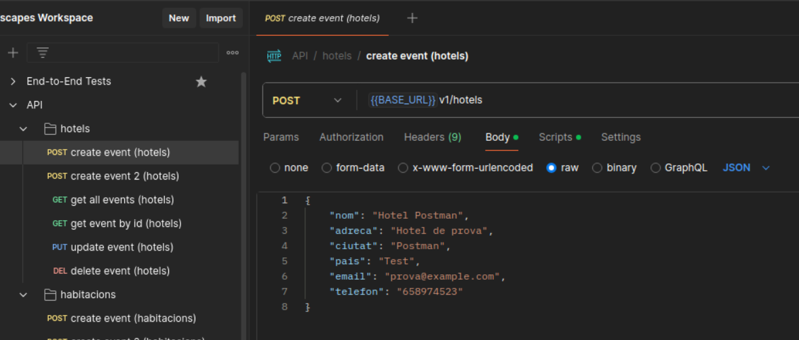
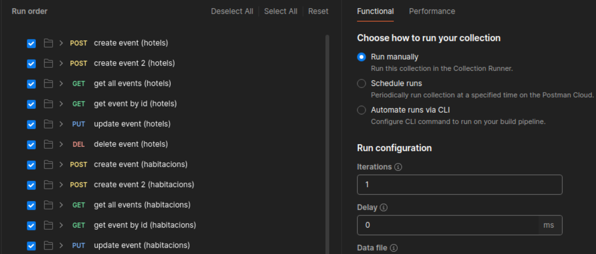
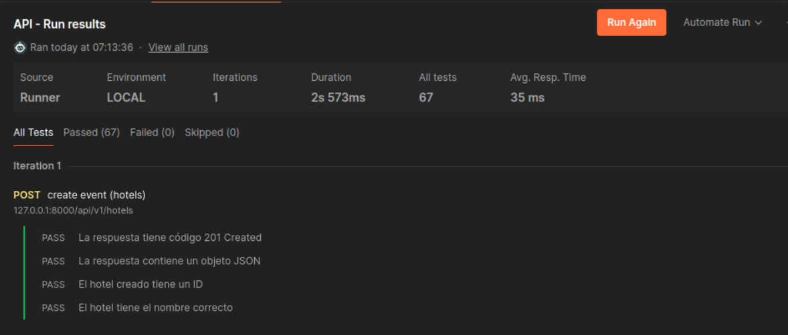

# Memoria UrbanaEscapes - Grup 6

## Introducció

Som el grup UrbanaEscapes, format per Pol González Miranda, Jon Perea Garcia i Edgar Quirante Sánchez. Aquest projecte desenvolupa un sistema de gestió per a una cadena hotelera, optimitzant les operacions internes i millorant l'experiència de reserva en línia. A més, inclou un lloc web públic que permet cercar hotels i reservar una habitació per a la teva estada.

## Objectiu de l'aplicació

L'objectiu principal de l'aplicació és oferir una solució digital completa per a la gestió hotelera, optimitzant tant l’experiència dels clients com els processos interns dels hotels. Per aconseguir-ho, el sistema es divideix en dues parts:

- **Web pública:** Permet als usuaris cercar hotels, consultar disponibilitat i realitzar reserves de manera fàcil i intuïtiva, millorant l’accessibilitat i l’experiència de l’usuari.

- **Plataforma interna:** Facilita la gestió de reserves, clients i disponibilitat per part dels hotels, millorant l’eficiència operativa i reduint la càrrega administrativa.

Aquest sistema busca digitalitzar i automatitzar processos per millorar la competitivitat dels hotels i oferir un servei més àgil i eficient.

## Public objectiu

L’aplicació està dirigida a dos grups principals d’usuaris:

1. Clients d’hotels:

    - Usuaris que busquen allotjament i volen realitzar reserves de manera ràpida i senzilla.
    - Viatgers ocasionals o freqüents que valoren una experiència intuïtiva i opcions personalitzades.
    - Persones que volen comparar diferents opcions d’hotels abans de fer una reserva.

2. Gestors i administradors d’hotels:

    - Responsables de la gestió hotelera que necessiten controlar reserves, ocupació i disponibilitat.
    - Personal de recepció que utilitza l’eina per verificar entrades i sortides de clients.
    - Propietaris d’hotels que volen millorar l’organització interna i optimitzar els beneficis.

Amb aquest enfocament, l’aplicació cobreix tant les necessitats dels clients com les dels hotels, oferint una eina útil per a ambdues parts.

## Diseny de la base de dades

* Diagrama de la BBDD

## Estils i diseny de les aplicacions

* link:https://www.figma.com/design/9rXC4C1gOy8ahfwJ5BZKMj/Guia-d'estils-UrbanaEscapes?node-id=159-50&t=Zvof1nqXFgUDUuFC-1[➡️ Guía d'estils UrbanaEscapes]

* link:https://www.figma.com/design/9rXC4C1gOy8ahfwJ5BZKMj/Guia-d'estils-UrbanaEscapes?node-id=636-2712[➡️ Figma Web Gestor]

* link:https://www.figma.com/design/9rXC4C1gOy8ahfwJ5BZKMj/Guia-d'estils-UrbanaEscapes?node-id=1384-475[➡️ Figma Web Pública]

## Escenaris de prova

En aquest projecte, fem servir diferents entorns per provar el sistema i assegurar-nos que funcioni correctament abans de desplegar-lo en producció. A continuació, es descriuen alguns dels escenaris més rellevants:

### AWS (Amazon Web Services)

Fem servir AWS per fer proves en un entorn de núvol, on podem simular situacions reals i avaluar el rendiment de l’aplicació. Alguns aspectes que comprovem són:

- Escalabilitat: Com respon el sistema a un increment de càrrega.
- Seguretat: Configuració d’accessos i protecció de dades.
- Disponibilitat: Com es comporta l’aplicació davant possibles errors o caigudes.

### Docker

Docker ens permet provar l’aplicació en un entorn controlat, assegurant que es pot executar de manera consistent en diferents sistemes. Fem proves per validar:

- Compatibilitat: Que totes les dependències funcionin correctament.
- Desplegament: Que el sistema es pugui configurar i executar sense problemes en diferentes màquines.

Aquestes proves ens ajuden a detectar i solucionar possibles problemes abans de posar el sistema en funcionament, garantint una millor experiència per als usuaris.

### Postman

Per realitzar proves d'API, validant el correcte funcionament de les peticions i respostes entre el front-end i el back-end.

* link:https://app.getpostman.com/join-team?invite_code=2c1199cbf197e17d6c2d0e3c4b17054585b861325b077c4b824b2fe4ca13c36f&target_code=7c71e9225b8bb35b4490520f0e194bc8[🔗 Enllaç Postman]

## Manual d'instal·lació i distribució

En aquesta secció es detallen els passos necessaris per instal·lar i distribuir el sistema de manera correcta.

* link:manualServidor.adoc[🔗 Manual del Servidor]

## Planificació i desviacions

Per a l'organització i seguiment del desenvolupament del projecte, hem utilitzat GitLab Issues per gestionar les tasques, assignar responsabilitats i establir prioritats. A més, per estimar la dificultat de cada tasca, hem fet servir la seqüència de Fibonacci (1, 2, 3, 5, 8, etc.), una tècnica habitual en gestió àgil que ens ha ajudat a valorar l’esforç necessari per completar cada issue.

### Planificació inicial

El projecte es va dividir en diverses etapes clau:

    1. Anàlisi i disseny – Definició de requisits, estructuració del sistema i creació dels primers esborranys.
    2. Desenvolupament de la plataforma interna – Creació del sistema de gestió per als hotels.
    3. Desenvolupament de la web pública – Implementació de la interfície i funcionalitats de reserva d’habitacions.
    4. Integració i proves – Validació del funcionament del sistema en diferents escenaris.
    5. Depuració i millores finals – Correcció d’errors i ajustos abans de la presentació final.

### Estimació de tasques amb Fibonacci

Per planificar el treball de manera eficient, cada tasca es va puntuar seguint la seqüència de Fibonacci:

- 1-2 punts: Tasques senzilles, com ajustar l’estil d’un botó o corregir petits errors.
- 3-5 punts: Desenvolupament de funcionalitats concretes i una mica mes complexes, com el sistema de reserves o la gestió d’usuaris.
- 8+ punts: Tasques més complexes que hem d'aprendre a fer servir o documentar-nos abans de desenvolupar.

Aquest sistema ens ha ajudat a tenir una millor previsió del temps necessari per cada fase del projecte i a detectar possibles colls d’ampolla.

### Desviacions i dificultats trobades

Tot i haver seguit la planificació inicial, ens hem trobat amb alguns imprevistos que han afectat el ritme de desenvolupament:

- Retards en algunes funcionalitats: Algunes tasques han requerit més temps del previst.
- Canvis en els requisits: Durant el desenvolupament, hem hagut d’ajustar algunes funcionalitats per adaptar-nos a noves necessitats.
- Problemes tècnics: Hem tingut dificultats amb el desplegament de totes dues webs, sobretot en la configuració dels servidors i la gestió de bases de dades, fet que ha endarrerit la fase final del projecte.

## Línies futures

De cara a futures millores i ampliacions del projecte, es poden implementar diverses funcionalitats tant a la web pública com a la interna per optimitzar l’experiència d’usuari i la gestió hotelera.

### Ampliacions de la web pública (reserva d'habitacions)

- **Programa de fidelització:** Implementació de descomptes i punts per a clients recurrents.
- **Comparació d’hotels:** Opció per comparar diferents establiments segons preu, valoracions i serveis oferts.
- **Xat amb atenció al client:** Assistència en temps real per resoldre dubtes durant el procés de reserva.
- **Integració amb transport i activitats:** Possibilitat de reservar trasllats o activitats juntament amb l’hotel.

### Ampliacions de la web interna (gestió hotelera)

- **Gestió avançada d’ocupació:** Predicció de disponibilitat i tarifes dinàmiques segons la demanda.
- **Automatització de check-in/check-out:** Generació automàtica de claus digitals i registre sense contacte.
- **Anàlisi i informes de rendiment:** Panell d'estadístiques per visualitzar ingressos, ocupació i tendències de clients.
- **Integració amb sistemes externs:** Connexió amb altres plataformes com Booking, Expedia o Airbnb per centralitzar la gestió de reserves.
- **Mòdul de gestió del personal:** Control d’horaris, tasques i torns per optimitzar la productivitat de l’equip.

Aquestes millores permetrien oferir una experiència més completa als usuaris i facilitarien la gestió dels hotels, fent el sistema més competitiu i eficient.

## Conclusions

El desenvolupament d’aquest projecte ha permès crear un sistema complet per a la gestió hotelera, combinant una web pública per a la reserva d’habitacions amb una plataforma interna per a l’administració de l’hotel. Aquesta solució optimitza tant l’experiència dels clients com l’eficiència operativa del personal.

D’una banda, la web pública facilita la cerca i reserva d’hotels de manera intuïtiva, millorant l’accessibilitat i la satisfacció dels usuaris. D’altra banda, la plataforma interna permet una gestió més eficient de les reserves, l’ocupació i els processos administratius, centralitzant tota la informació en un sol entorn.

Tot i els avanços aconseguits, hem anat justos de temps per implementar algunes funcionalitats que haurien millorat encara més el sistema. Amb més marge, hauríem pogut aprofundir en aspectes. Malgrat això, el projecte ha assolit els objectius principals i estableix una bona base per a possibles millores en el futur.

## Glossari

En aquesta secció es defineixen alguns termes clau utilitzats en el projecte:

- **Reserva:** Procés mitjançant el qual un usuari selecciona i confirma una habitació en un hotel.
- **Check-in / Check-out:** Procediments d’entrada i sortida dels clients a l’hotel.
- **Recepció:** Àrea de l'aplicació on s’atén als clients i es gestionen les reserves.
- **Pròximes reserves:** Àrea de l’aplicació on es mostren les reserves pendents, permitint fer Check-in.
- **Habitacions bloquejades:** Àrea de l’aplicació on es gestionen les habitacions fora de servei.

## Web-grafia

Llista de fonts i recursos consultats durant el desenvolupament del projecte:

- link:https://developer.mozilla.org/es/[**MDN Web Docs**] - Documentació i recursos sobre desenvolupament web.
- link:https://fonts.google.com/icons[**Google Fonts**] - Fonts i icones de Google.
- link:https://www.youtube.com/c/midudev[**Midudev**] - Tutorials i recursos sobre programació i desenvolupament web.
- link:https://vuejs.org/guide/introduction.html[**Vue.js**] - Documentació oficial de Vue.js.
- link:https://tailwindcss.com/docs/styling-with-utility-classes[**Tailwind CSS**] - Documentació oficial de Tailwind CSS.
- link:https://www.youtube.com/watch?v=nTlq_73zRm8[**Tutorial botons CSS**] - Tutorial per fer botons amb estat a CSS.

## Altres recursos de consulta

A més de les fonts anteriors, hem utilitzat documentació i tutorials relacionats amb:

- Bones pràctiques en desenvolupament web i gestió de bases de dades.
- Casos d’estudi sobre sistemes de reserves hoteleres.

## Presentació del projecte