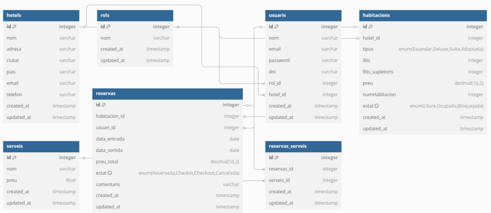

= Memòria

== Introducció

Bones, som el grup de UrbanaEscapes format per Pol González Miranda, Jon Perea Garcia i Edgar Quirante Sánchez. Aquest projecte desenvolupa un sistema de gestió per a una cadena hotelera, optimitzant operacions internes i millorant l'experiència de reserves en línia.

== Disseny de base de dades

* Diagrama de la BBDD

== Guia d'estil

* link:https://www.figma.com/design/9rXC4C1gOy8ahfwJ5BZKMj/Guia-d'estils-UrbanaEscapes?node-id=159-50&t=Zvof1nqXFgUDUuFC-1[Guía d'estils UrbanaEscapes]

== Escenaris de prova

* AWS, Docker, etc.

== Manual d’instal·lació/distribució

* link:manualServidor.adoc[Manual del Servidor]

== Manual d’usuari          

== Línies futures

* Ampliacions possibles del projecte

== Conclusions

== Glossari

== Web-grafia

== Altres recursos de consulta

== Presentació del projecte