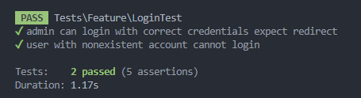
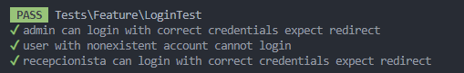
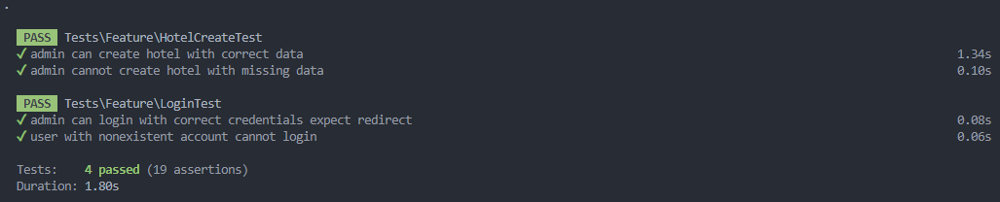
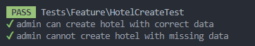
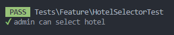
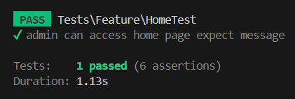
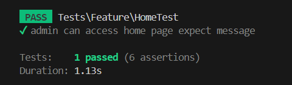
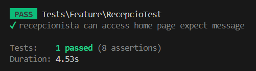

= Documentació de Proves

====
**ID de la prova:** P-Login-01

**Nom de la prova:** Validació login. 

**Pantalla afectada:** Pantalla de login usuari administrador.
  
**Objectiu:** Verificar que inicia sessió amb els credencials correctes d’administrador.

**Precondicions:** L’usuari ja ha d’estar a la base de dades.  
====

.Passos a seguir:
. Crear rols i usuari.
. Verificar si es por accedir al login (/login).
. Fa login amb les credencials correctes.
. Verifica si redirecciona a la home (/).

**Resultat esperat:** Comprova les credencials i redirecciona si son correctes.

**Resultat obtingut:** Redirecciona correctament.

**Estat:** Superada. ✅

**Evidències:** Adjuntes. 

---

====
**ID de la prova:** P-Login-02  

**Nom de la prova:** Validació login sense usuari registrat.  

**Pantalla afectada:** Pantalla de login.  

**Objectiu:** Verificar que no inicia sessió amb els credencials d’un usuari que no està a la base de dades.  

**Precondicions:** Cap.  
====

.Passos a seguir:
. Verificar si es por accedir al login (/login).
. Fa login amb les credencials random.
. Mostra missatge d’error.

**Resultat esperat:** Comprova les credencials i mostra missatge d’error.  

**Resultat obtingut:** Mostra el missatge correctament.  

**Estat:** Superada.  ✅

**Evidències:** Adjuntes.  

---

====
**ID de la prova:** P-Login-03  

**Nom de la prova:** Validació login d’usuari recepcionista.  

**Pantalla afectada:** Pantalla de login.  

**Objectiu:** Verificar que inicia sessió amb els credencials correctes de l’usuari recepció.  

**Precondicions:** L’usuari admin ha d’estar a la base de dades i ha d’haver creat un hotel.  
====

.Passos a seguir:
. Crear rols, usuari admin i l’hotel de prova.
. Verificar si es por accedir al login (/login).
. Fa login amb les credencials correctes de recepció.
. Verifica si redirecciona a la home del recepcionista (/recepcio?id=1).

**Resultat esperat:** Comprova les credencials i redirecciona si son correctes.  

**Resultat obtingut:** Redirecciona correctament.  

**Estat:** Superada.  ✅

**Evidències:** Adjuntes.  

---

====
**ID de la prova:** P-Hotel-01  

**Nom de la prova:** Crear hotel.  

**Pantalla afectada:** Pantalla de creació d’un hotel.  

**Objectiu:** Verificar que l’administrador pot crear un hotel.  

**Precondicions:** L’usuari “admin” ja ha d’estar a la base de dades.  
====

.Passos a seguir:
. Crear rols i usuaris.
. Fa login amb les credencials de l'administrador.
. Redirecciona a la pantalla de crear un hotel.
. Crea un hotel amb dades random.
. Redirecciona al home del hotel.

**Resultat esperat:** Comprova les credencials, crea l’hotel i redirecciona al home. 

**Resultat obtingut:** Logeja, crea l’hotel i redirecciona correctament.  

**Estat:** Superada.  ✅

**Evidències:** Adjuntes. 

---

====
**ID de la prova:** P-Hotel-02  

**Nom de la prova:** Crear hotel sense algun camp.  

**Pantalla afectada:** Pantalla de creació d’un hotel.  

**Objectiu:** Verificar que l’administrador no pot crear un hotel sense algun camp.

**Precondicions:** L’usuari “admin” ja ha d’estar a la base de dades.  
====

.Passos a seguir:
. Crear rols i usuaris.
. Fa login amb les credencials de l'administrador.
. Redirecciona a la pantalla de crear un hotel.
. Intenta crear un hotel sense algun camp.
. Mostra un missatge d’error.

**Resultat esperat:** Comprova les credencials i mostra el missatge d’error.  

**Resultat obtingut:** Logeja i mostra el missatge correctament.  

**Estat:** Superada.  ✅

**Evidències:** Adjuntes.

====
**ID de la prova:** P-Hotel-03  

**Nom de la prova:** Selecciona un hotel.  

**Pantalla afectada:** Pantalla de seleccio d’un hotel.  

**Objectiu:** Verificar que l’administrador pot seleccionar un hotel.

**Precondicions:** L’usuari “admin” ja ha d’estar a la base de dades i l'hotel ja ha d'estar creat.  
====

.Passos a seguir:
. Crear rols i usuaris.
. Fa login amb les credencials de l'administrador.
. Redirecciona a la pantalla de crear un hotel.
. Intenta crear un hotel sense algun camp.
. Redirecciona a la pantalla de seleccio.
. Selecciona un hotel.

**Resultat esperat:** Comprova les credencials i selecciona l'hotel.  

**Resultat obtingut:** Selecciona un hotel correctament.  

**Estat:** Superada.  ✅

**Evidències:** Adjuntes.

====
**ID de la prova:** P-Hotel-04

**Nom de la prova:** Validació missatge al accedir. 

**Pantalla afectada:** Pantalla de l'inici de l'aplicació.
  
**Objectiu:** Verificar que apareix un missatge al entrar a la pàgina.

**Precondicions:** L’usuari ja ha d’estar a la base de dades i ha de ser administrador.  
====

.Passos a seguir:
. Crear rols i usuari.
. Verificar si es por accedir al login (/login).
. Fa login amb les credencials correctes.
. Verifica si redirecciona a la home (/).

**Resultat esperat:** Apareix el missatge "Selecciona l'hotel a consultar".

**Resultat obtingut:** Apareix el missatge correctament.

**Estat:** Superada. ✅

**Evidències:** Adjuntes. 

---

====
**ID de la prova:** P-Sidebar-01

**Nom de la prova:** Apareixen botons concrets. 

**Pantalla afectada:** Sidebar de l'aplicació.
  
**Objectiu:** Verificar que apareixen els botons corresponents.

**Precondicions:** L’usuari ja ha d’estar a la base de dades i ha de ser recepcionista.  
====

.Passos a seguir:
. Crear rols i usuari.
. Verificar si es por accedir al login (/login).
. Fa login amb les credencials correctes.
. Verifica si redirecciona a la home (/).

**Resultat esperat:** Apareixen els botons "Recepció" i "Pròximes Reserves".

**Resultat obtingut:** Apareixen els botons correctament.

**Estat:** Superada. ✅

**Evidències:** Adjuntes. 

---

====
**ID de la prova:** P-Sidebar-02

**Nom de la prova:** No apareixen botons concrets. 

**Pantalla afectada:** Sidebar de l'aplicació.
  
**Objectiu:** Verificar que no apareixen els botons corresponents.

**Precondicions:** L’usuari ja ha d’estar a la base de dades i ha de ser admin.  
====

.Passos a seguir:
. Crear rols i usuari.
. Verificar si es por accedir al login (/login).
. Fa login amb les credencials correctes.
. Verifica si redirecciona a la home (/).

**Resultat esperat:** No apareixen els botons "Recepció" i "Pròximes Reserves".

**Resultat obtingut:** No apareixen els botons correctament.

**Estat:** Superada. ✅

**Evidències:** Adjuntes. 

---

====
**ID de la prova:** P-Recepcio-01

**Nom de la prova:** Apareix el nom de l'hotel.

**Pantalla afectada:** Recepció (calendari de reserves).
  
**Objectiu:** Verificar que apareix el nom del hotel correctament.

**Precondicions:** L’usuari ja ha d’estar a la base de dades.  
====

.Passos a seguir:
. Crear rols i usuari.
. Verificar si es por accedir al login (/login).
. Fa login amb les credencials correctes.
. Anar a la pàgina de recepció (/recepcio?id=1).

**Resultat esperat:** Apareix el nom del hotel.

**Resultat obtingut:** Apareix el nom del hotel correctament.

**Estat:** Superada. ✅

**Evidències:** Adjuntes. 

---